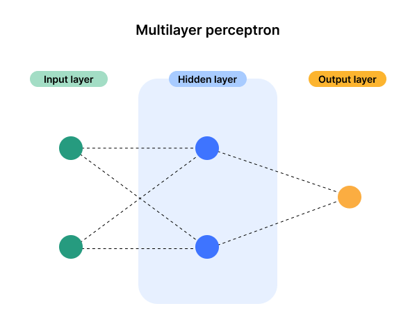
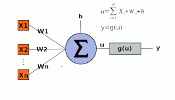

<h1 align="center" style='color: lime;'>
	Multi Layer Perceptron Network (from scratch)
</h1>

	

## Descrição

Este projeto é uma implementação de uma rede neural MLP (Multi Layer Perceptron) em `Python`. O objetivo é servir como um objeto de aprendizagem prático para os conceitos aprendidos na disciplina de Cálculo Numérico sobre redes neurais e suas relações com as disciplinas de matemática fundamentais aprendidadas em um curso de Ciência da Computação, como Cálculo, Álgebra Linear, Geometria Analítica, Estatística e outras. Dessa forma, muitas das facilidades da biblioteca `scikit-learn` do Python não foram usadas, pois a ideia é evidenciar os cálculos inerentes ao funcionamento da rede, aproximando-se o máximo possível da teoria matemática envolvida.

## Arquitetura da Rede
Atualmente, a rede é composta por apenas 3 camadas:
+ **1 Camada de entrada:**
+ **1 Camada oculta:**
+ **1 Camada Oculta:**

Cada camada pode possuir qualquer número (não nulo) de neurônios, como na figura abaixo:

## Perceptrons: os neurônios matemáticos
Cada camada da rede é composta por perceptrons, que são representações matemáticas de um neurônio biológico e possuem a seguinte forma:

A figura denota por `X1, X2, ..., Xn` os valores das variáveis de entrada, por `W1, W2, ..., Wn` os pesos das entradas, por `b`o bias do referido neurônio, por `u` a saída do combinador linear (representado com um símbolo de somatório, ou letra grega Sigma maiúsculo) e por `y` a saída do neurônio, que é o resultado da função de ativação `g`.

## Funções de Ativação usadas
+ **Tangente hiperbólica:** para os neurônios da camada oculta
+ **Softmax:** para os neurônios da camada de saída

## Como usar
**1. Usando o Colab Notebook** 
Abra o [colab notebook](./Notebooks/RedeMLP_Colab.ipynb) deste repositório, então você pode tanto usar a opção `Open in Colab` quanto fazer upload dele em sua própria conta e executar por lá. Execute as células em sequência, conforme indicado no próprio notebook.

**2. Usando os scripts em Python localmente**
Nessa opção, o conteúdo principal está na pasta [Project_python](./Project_python). Após baixar localmente o repositório, crie um ambiente virtual, ative-o e instale as dependências necessárias dentro dele com o comando `pip install -r requirements.txt`.

Em seguida, execute o arquivo `main.py`. Ao final dos dois treinamentos que ocorrerão, interaja com o programa escolhendo:
+ 0: para "Sair"
+ 1: para "Plotar gráficos comparativos do treinamento e dos resultados"
+ 2: para "Salvar o modelo em .pickle (com variáveis normalizadas)"

## Observações
+ **Importância da Normalização**: Os dados de entrada devem ser escolhidos com critério, uma vez que, mesmo em um dataset já tratado, a escolha de uma combinação ruim de valores (quando em escalas distintas, por exemplo) pode prejudicar o treinamento do modelo. O próprio Colab Notebook deste repositório ilustra isso comparando as performances de treino e os resultados gerados por duas abordagens: uma sem normalização e outra com normalização de variáveis.
+ Os conceitos aqui apresentados são resumos, por isso, recomenda-se a pesquisa em artigos e em vídeos sobre o assunto, a fim de conseguir um entendimento mais detalhado e facilitar o entendimento do código.

## Limitações
+ **Número de camadas ocultas:** o código ainda não permite trabalhar com mais do que 1 camada oculta.

## Referências
+ [Machine Learning para humanos](https://www.youtube.com/playlist?list=PLQH6T1jnIb5I1s7chxtL24ZuX4g-PA7uK)
+ [Normalização de variáveis](https://geam.paginas.ufsc.br/files/2020/02/feature-scaling.pdf)

## Contribuidores

 